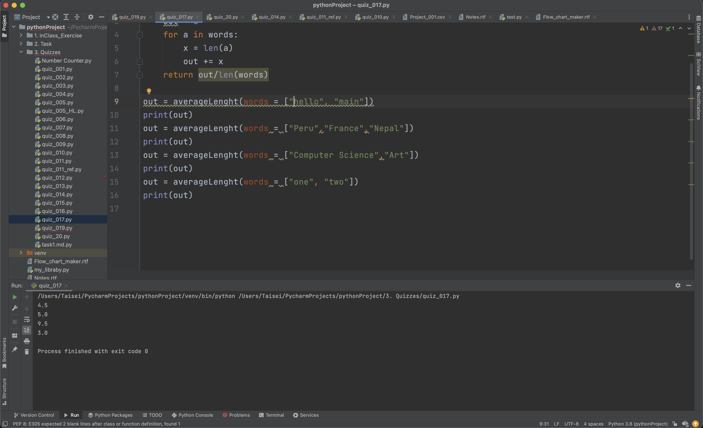

# Quiz_017

Take the words in the list and find the average of the number of the letters.
I used the for loop and put the word into the variable a and foud the length of it and add it to the output later on divioded it.

```.py
def averageLenght (words :list) -> int:

    out = 0
    for a in words:
        x = len(a)
        out += x
    return out/len(words)

out = averageLenght(words = ["hello", "main"])
print(out)
```
## Proof of work

