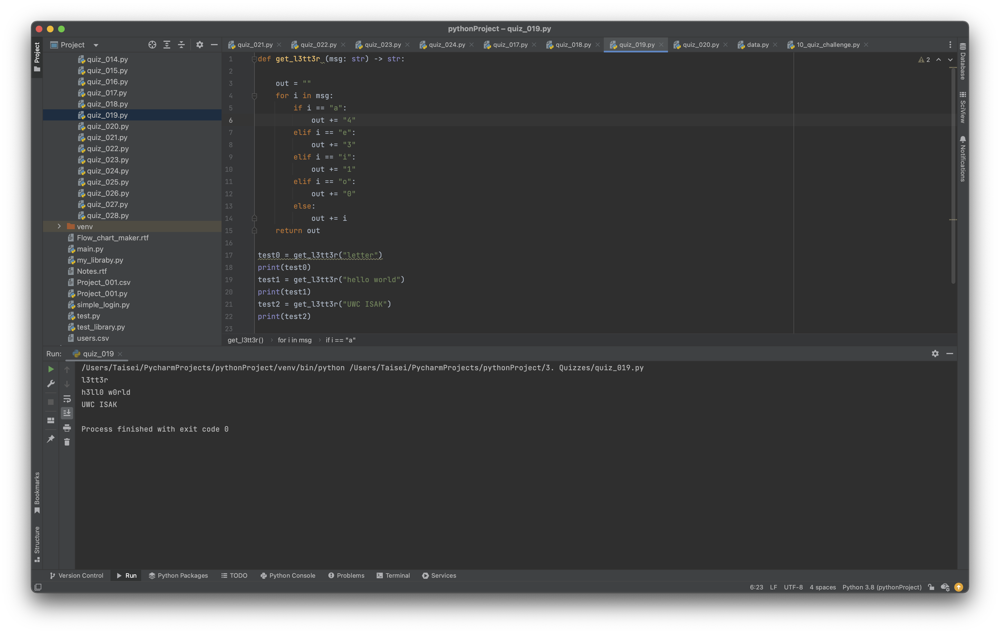

# Quiz_017

Create a function that changes the vowels in a string to numbers such as a=4,e=3,i=1,o=0 and space by _.

```.py
def get_l3tt3r (msg: str) -> str:

    out = ""
    for i in msg:
        if i == "a":
            out += "4"
        elif i == "e":
            out += "3"
        elif i == "i":
            out += "1"
        elif i == "o":
            out += "0"
        else:
            out += i
    return out

test0 = get_l3tt3r("letter")
print(test0)
test1 = get_l3tt3r("hello world")
print(test1)
test2 = get_l3tt3r("UWC ISAK")
print(test2)
```

### Bonus
AB + not(B+C) + B(notC notA)


## Proof of work

**Fig. 1** Evidence that the program works for the three cases in the slide


**Fig. 2** Evidence of work for part b
