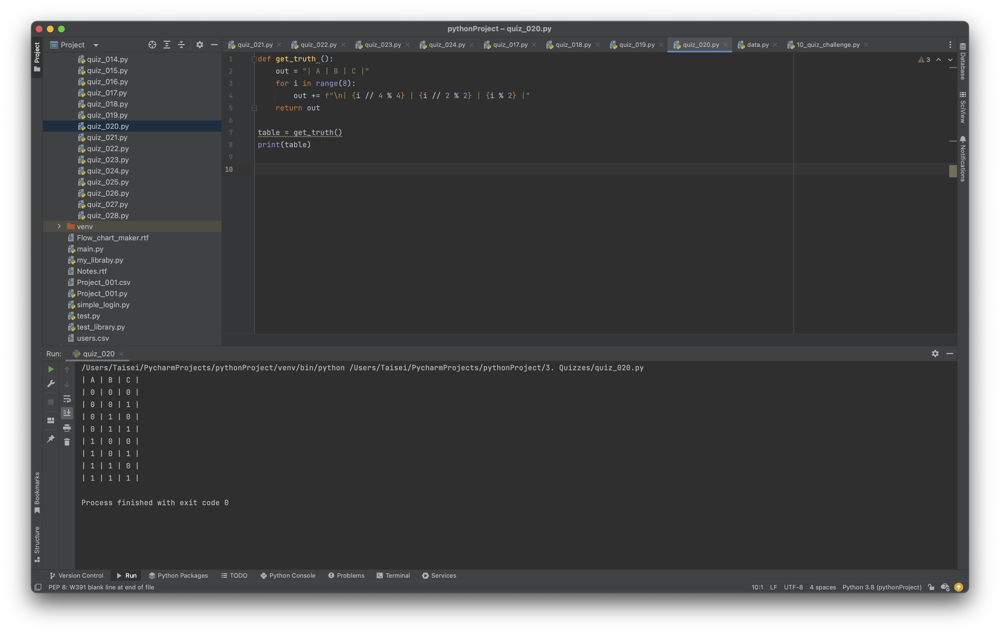

# Quiz_020

Create a function that produces the table of Truth for 3 inputs.


```.py

def get_truth ():
    out = "| A | B | C |"
    for i in range(8):
        out += f"\n| {i // 4 % 4} | {i // 2 % 2} | {i % 2} |"
    return out

table = get_truth()
print(table)

```

### Bonus
Truth table and circuit for: Light = S1S2+(S2+S3(notS1))S1


## Proof of work

**Fig. 1** Evidence that the program works for part a


**Fig. 2** Evidence of work for part b
