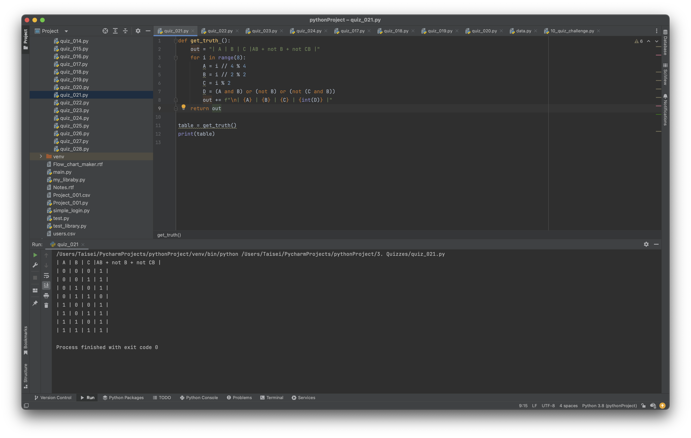

# Quiz_021

Using the function that produces the table of Truth for 3 inputs, add a column for the boolean equation - AB+(not B)+(notB C)

```.py

def get_truth ():
    out = "| A | B | C |AB + not B + not CB |"
    for i in range(8):
        A = i // 4 % 4
        B = i // 2 % 2
        C = i % 2
        D = (A and B) or (not B) or (not (C and B))
        out += f"\n| {A} | {B} | {C} | {int(D)} |"
    return out

table = get_truth()
print(table)

```

### Bonus
Truth table and circuit for: X = ZW ⨁ (Z ⨁ Y(not W))


## Proof of work

**Fig. 1** Evidence that the program works for part a


**Fig. 2** Evidence of work for part b
