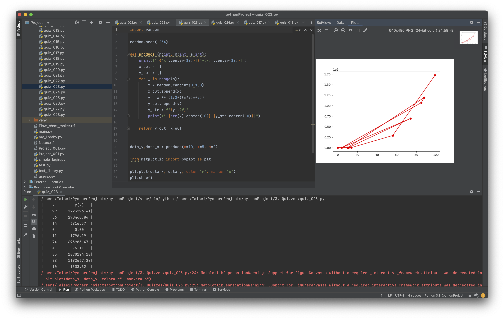

# Quiz_021

Create a program that produces the graph for the function in Quiz #22

```.py

import random

random.seed(1234)

def produce (n:int, m:int, s:int):
    print(f"|{'x'.center(10)}|{'y(x)'.center(10)}|")
    x_out = []
    y_out = []
    for _ in range(n):
        x = random.randint(0,100)
        x_out.append(x)
        y = x ** (1/2*((m/s)**2))
        y_out.append(y)
        y_str = f"{y:.2f}"
        print(f"|{str(x).center(10)}|{y_str.center(10)}|")

    return y_out, x_out


data_y,data_x = produce(n=10, m=5, s=2)

from matplotlib import pyplot as plt

plt.plot(data_x, data_y, color="r", marker="o")
plt.show()

```

### Bonus
Truth table for: A(A ⊕ B)


## Proof of work

**Fig. 1** Evidence that the program works for part a


**Fig. 2** Evidence of work for part b
