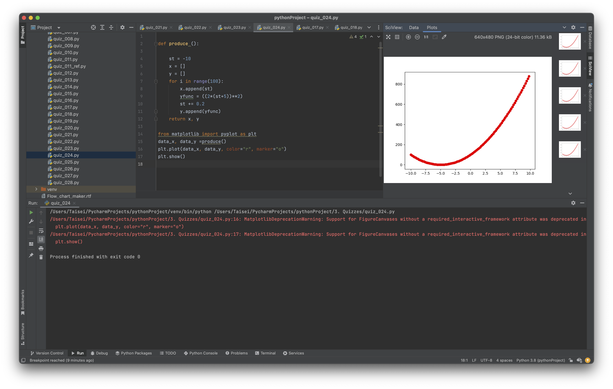

# Quiz_021

Create a program shows the graph of the parabola for 100 values of x in the interval -10 < x < 10

```.py

def produce (n:int, m:int, s:int):
    print(f"|{'x'.center(10)}|{'y(x)'.center(10)}|")
    out = 0
    st = -10
    for i in range(100):
        x.append(st)
        y = 2*(st+5)**2
        st -= 0.2
        print(f"|{str(st).center(10)}|{y.center(10)}|")
    return out

from matplotlib import pyplot as plt

plt.plot(x, y, color="r", marker="o")
plt.show()

```

### Bonus
Circuit for: not(bit0 bit1 + not (bit0 + bit1))


## Proof of work

**Fig. 1** Evidence that the program works for part a


**Fig. 2** Evidence of work for part b
