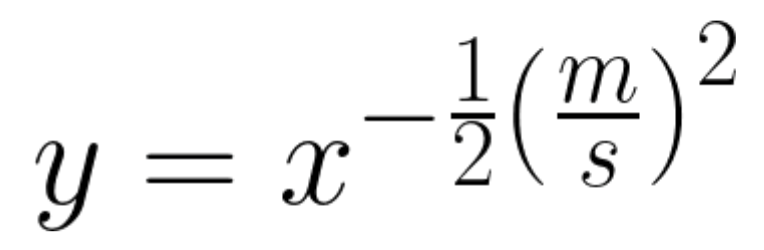

# Quiz_021

Create a program that produces n random values from the equation below, where m and s are the other inputs of the function



```.py

import random

random.seed(1234)
def produce(n:int, m:int, s:int) -> int:
    out = "| x | y(x) |"
    for i in range(n):
        x = random.randint(0, 100)
        y = x ** (1 / 2 * (m / s) ** 2)
        i += 1
        out += f"\n| {x} | {y} |"
    return out


sample = produce(n=5, m=3, s=2)
print(sample)

```

### Bonus
Proof that: A (A + B) = A 


## Proof of work

**Fig. 1** Evidence that the program works for part a


**Fig. 2** Evidence of work for part b

